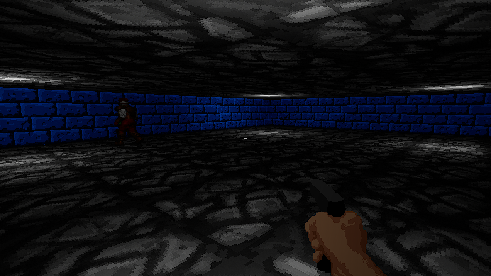

# DoomClone

This prototype uses the Gameplay Ability System and a few basic materials to make a FPS with 2D sprites.

Features
* 3D environment with lighting and materials for sprites (take textures as-is)
* Player character
* Billboard flipbook animations
* Weapon pickup & shooting
* Enemy behaviour tree & EQS

Generally, Health and Armor GAS properties are defined in cpp, then manipulated in blueprint. A brief inheritance tree of the game entities looks like this:

* BP_RetroCharacter
    * BP_FPSPlayer
    * BP_Enemy
        * BP_PistolEnemy

